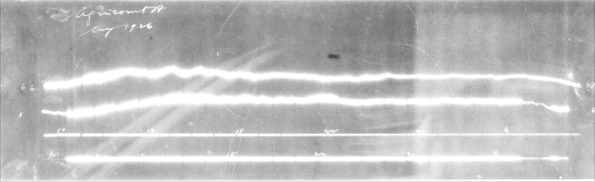

```{r setup, include = FALSE}
knitr::opts_chunk$set(
  collapse = TRUE,
  comment = "#>"
)
```


```{r lib, message = FALSE}
library(magneto)
library(rtiff)
library(tiff)
rawTiff <- "AGC-D-19040830-19040901.tif"
```


This package is intended to be used on scanned images in .tif or .tiff format.  Other formats can be used if another image importing function is created by the user.  The functions shown below are meant to be building blocks for digitization of many types of images plotted against time.  TIS (Trace Identification through Separation) and TISI (Trace Identification through Separation Improvement) are intended, in the default state, to be only used for magnetogram images;  that being said, all parameters can be altered for use in other applications.  It is recommended to find parameters for TIS and TISI by using the other mentioned functions below.


## Worked example with a magnetogram, following the process used by TIS and TISI

Both TIS and TISI use 10 main functions to do the image processing. Note: all functions mentioned are available from the NAMESPACE for use by anyone.

### import_process_image()

- **Required**
  - imageName	
    - The name of the file.
  
  - file_loc	
    - The path from ~/ (home) to the dir where the file is.
    
- **Optional**
  - trimAmountTop, 	Default = 100
    - Number of pixels off of top of image (usually for common flares).
  
  - trimAmountBottom, Default = 50
    - Number of pixels off of bottom of image.

  - beta0, Default = -2.774327 	
    - The intercept of a logistic regression default is for magnetograms.
  
  - beta1, Default = 51.91687
    - The slope of the logistic regression default is for magnetograms.
  
  - cutoffProbability, Default = 0.5	
    - The probability cut off for the decision of an imageMatrix being bright.

  - NADefault, Default = 0
    - The default value set to NA's found in the matrix.
  
  - FilterBright, Default = c(13, 13)	
    - Vector specifying the dimensions of the kernel, which will be used to perform either delation or erosion, such as c(13,13).
  
  - FilterNonBright	, Default = c(8,8)
    - Vector specifying the dimensions of the kernel, which will be used to perform either delation or erosion, such as c(8,8).
  
  - methodBright, Default = "delation"	
    - One of 'delation'(adds to image, making brights brighter), 'erosion' (subtracts from image brights darker). See OpenImageR for description.

  - methodNonBright, Default = "delation"	
    - One of 'delation'(adds to image, making brights brighter), 'erosion' (subtracts from image brights darker). See OpenImageR for description.
  
  - thresholdBright, 	Default = 0.8
    -  Used for an image considered bright by the logistic regression. The number should be between 0 and 1 for black and white pixels, where the Default = 0.8 any pixel over this threshold will be turned 1(white) and anything under will be turned to 0(black).

  - thresholdNonBright, Default = 0.5	
   	- Used for an image considered not bright by the logistic regression.  The number should be between 0 and 1 for black and white pixels, where the Default = 0.5 any pixel over this threshold will be turned 1(white) and anything under will be turned to 0(black).
  
```{r, fig.width=6 , cache = TRUE}
Original <- readTIFF("Images/AGC-D-19040907-19040909.tif")
par(mar = c(0,0,0,0))
plot(Original)
```
  
As seen from the image above, the image is in the incorrect orientation for processing and viewing.  It can also be seen that parts of the two right lines are inconsistent, and fade in and out in the bottom quarter of the plot.  The image processing, below, fixes these issues, as well as well as increasing the contrast to produce only fully white (1) or fully black pixels (0). This decision comes down to thresholdBright and thresholdNonBright, described above. 
```{r warning=FALSE, cache=TRUE}
processedImage <- import_process_image(imageName = "AGC-D-19040907-19040909.tif",
                                       file_loc = "Images/")
```

```{r, cache=TRUE, warning=FALSE, fig.width=6}
par(mar = c(0,0,0,0))
plot(processedImage)

```

### Note on beta1 and beta0 parameters in the function.

The image below is an example of an overexposed image, as a consequence of the scanning process. This is where beta1 and beta0 are used.
```{r, out.width = '95%', echo = FALSE, fig.cap="Bright1: Considered to be bright"}

```

 Taking a sample of 392 images, we created a vector of 1's (bright) or 0's(not bright) based off of a decision if an image was bright or not using a list of criteria:

* Is the image border overexposed?
* Are the traces lost because of whiteness?
* Is there an overexposed part to the picture? This could be a section that is just illegible.

If two or more of these were true, we answered yes to the image being bright.  
Once this vector was established, there was a need to find a way of predicting the outcome;  A logistic regression model was used for this, as it gave us the probability of the image being bright.  The response(our decisions about the 392 images) was modeled using the glm() in R:

$$
\text{Bright Decision} = \frac{e^{-2.7743 + 51.9169*Standard}}{(1+e^{-2.7743 + 51.9169*Standard})}
$$

with, 

$$
 \text{Standard} = \frac{\text{The pixels in the image above 80th percentile}}{\text{Total number of pixels}}
$$
These, beta0 and beta1, will need to be configured for your respective data set if overexposed images are a problem.  
